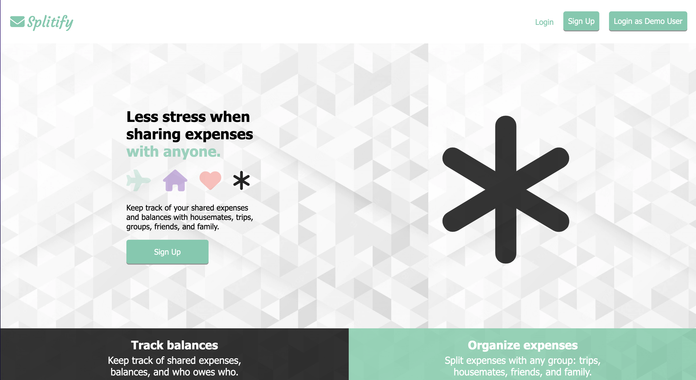
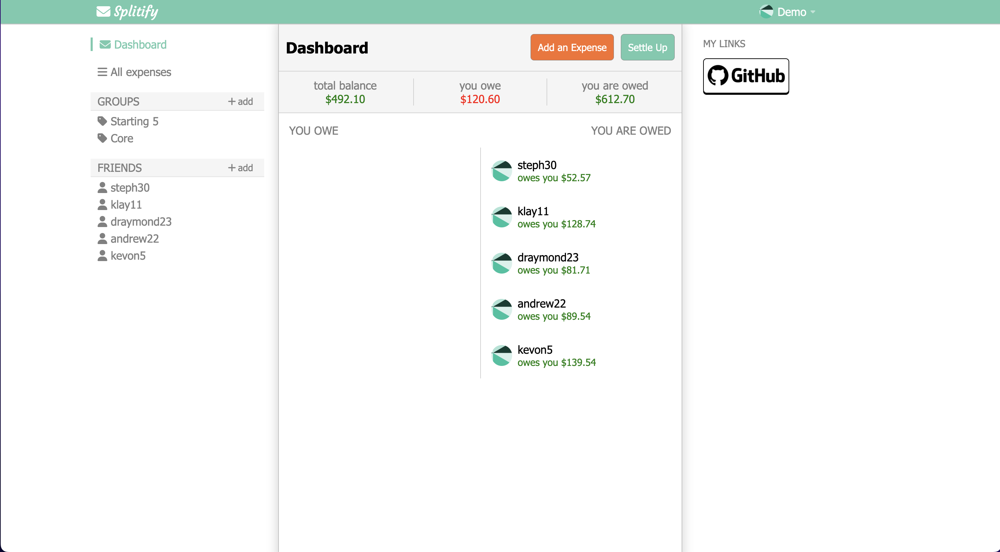

# Splitify
Splitify is a web tool inspired by Splitwise. Splitify allows groups of users to keep to track bills and other shared expenses amongst the group. Splitify keeps track of all the expenses of the group and the payments between users of the group. Splitify ensures that everyone is reimbursed the correct amount.

[Live Site](https://splitify.onrender.com/)

## Wiki Link
[Link to Wiki](https://github.com/cgalang9/Splitify/wiki)
* Wiki Contains
   * Feature List
   * User Stories
   * Database Schema
   * Redux Store Shape
   * API docs

## Technologies Used
* Python
* Flask
* SQLAlchemy
* Alembic
* WTForms
* Flask-Migrate
* Flask-Login
* Javascript
* Node.js
* React
* React Router
* Redux
* HTML
* CSS
* Render
* PostgreSQL

## Landing Page

## Sample Dashboard (page after login)

##  How to Launch the Application Locally
1. Clone or download the repo
2. Install dependancies:
     * run npm install in the root folder
     * cd into the app folder and run pipenv install
     * cd into the react-app folder and run npm install
3. Run pipenv shell in app folder. Run flask run in the newly opened shell.
4. Run npm start in react-app folder

## Project Creator
* Carmelino Galang
   * [Link to Github](https://github.com/cgalang9)
